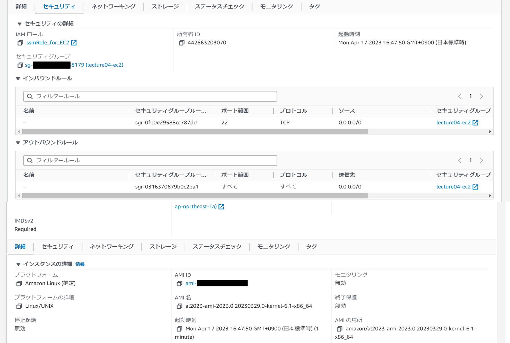
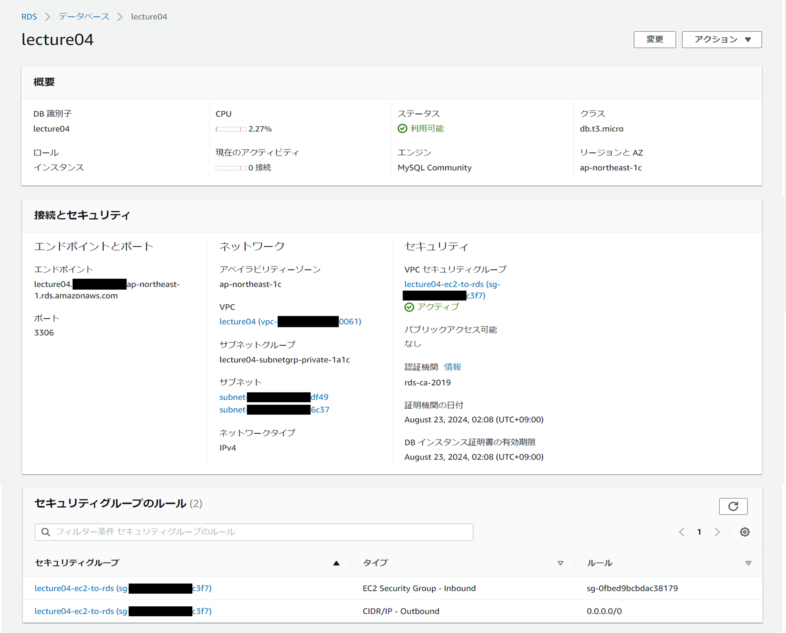

## AWS環境の構築（VPC/EC2/RDS）

### 構築内容
AWSマネジメントコンソールでVPC/EC2/RDSを構築し、EC2からRDSへ正常に接続出来ることを確認する。  

#### 行ったこと
1. VPC設定
2. EC2設定
3. RDS設定
4. EC2にMySQLクライアントインストール

#### VPC設定  
- VPCのウィザードを利用し、プライベートサブネット、パブリックサブネットを作成する。  
  

#### EC2設定  
- Amazon Linuxのインスタンスを起動する。
  

- セキュリティグループを作成し、外部からEC2への接続を許可する。  
  

#### RDS設定  
- MySQLを選択しRDSを起動する。  
  

- サブネットグループでプライベートサブネットを2つ割り当て、
セキュリティグループを作成してEC2からRDSへの接続を許可する。  
  - ルール1  
    
  - ルール2  
    

#### MySQLクライアント
- Amazon LinuxのインスタンスからMySQLに接続するために必要。  
MySQLに必要なリポジトリをダウンロードのうえ、yumコマンドでクライアントをインストールする。  
  

### 動作確認
#### EC2からRDSへの接続確認
RDSのエンドポイント、MySQL用のポート番号、ユーザ名を指定して接続。  
RDS作成時に設定したパスワードを入力して接続できたことを確認。  
  