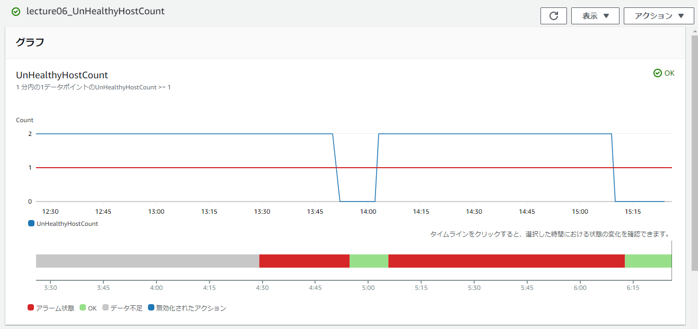
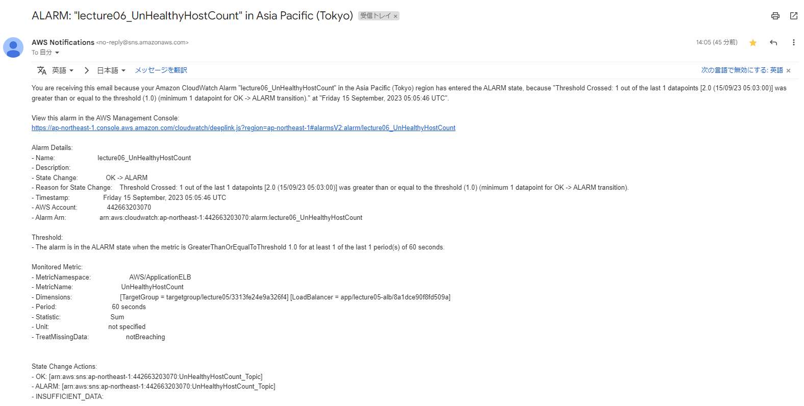
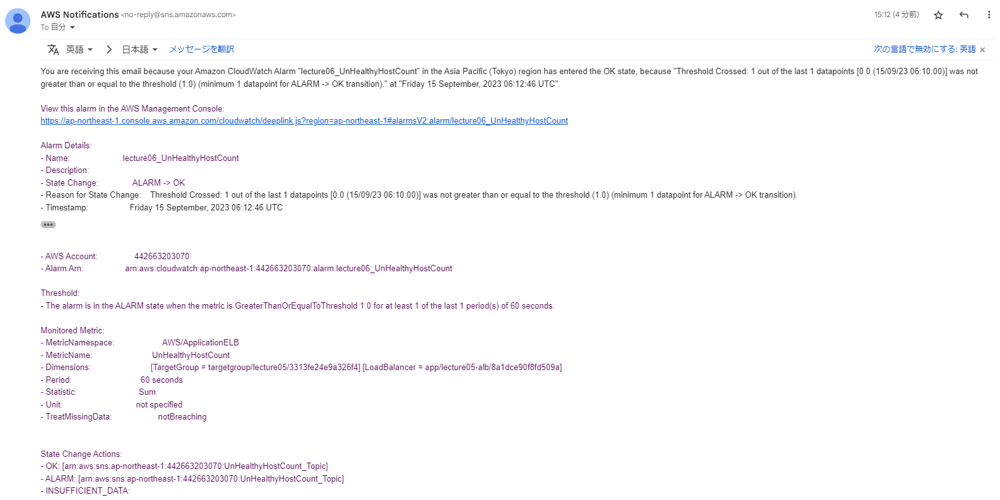
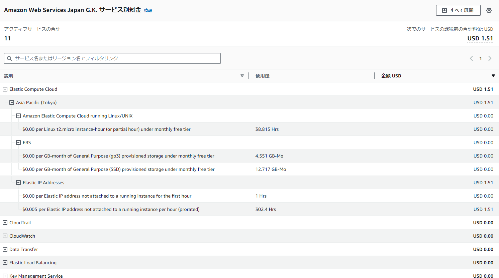
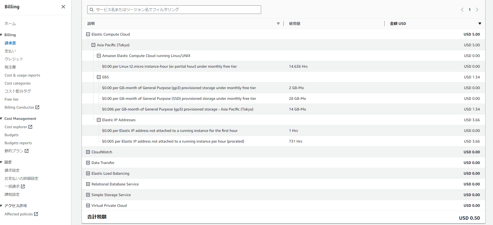

## リソース監視とコスト管理
AWSで環境を構築して終わりではなく、環境自体や挙動に異常が起きていないか監視することが非常に重要。  
また、不正利用の検出やコスト削減のために請求情報の確認・管理も必要となる。    

### 行ったこと
- RailsアプリをデプロイしたAWSリソース上で、CloudWatchアラームを設定し監視する。  
- これまでに発生したCloudTrailのイベント記録を確認し分析する。  
- これまでにかかった利用コストを確認し分析する。  
- これまでに作成したAWSリソースの利用料を見積もる。

#### CloudWatchアラーム
- 設定内容
  - CloudWatchアラームでALBのアラームを設定し、Railsアプリ起動時／停止時にAmazon SNSからアラートメールが発報されるよう設定する。  

- 事前準備  
  - Unicornが起動していなくても動作確認できるよう、ヘルスチェックに使用するファイルパスを「/404.html」に変更。  

- アラーム設定  
  - UnHealthyHostCountの合計数が1以上になった時に「アラーム状態」とみなしメールを送信、そうではない時に「OK」とみなしメールを送信する。  

- 結果  
  - ヘルスチェックに成功した合計数に応じて「アラーム状態」または「OK」の状態になった。  
    

  - Nginx停止時：（14:05頃）UnHealthyHostCountの合計が1以上となった。「アラーム状態」になり「ALARM」のメール通知。  
    
  
  - Nginx起動時：UnHealthyHostCountの合計が1以下となった。「OK」になり「OK」のメール通知。  
    

#### CloudTrailイベント記録 
- 確認内容
  - 自身で作成したIAMユーザー名のCloudTrailイベント記録を確認し、イベント名とイベント内容を分析する。

1.イベント名：RevokeSecurityGroupIngress  
- Event source：ec2.amazonaws.com  
- User agent：AWS Internal  
- Resources：[{"resourceType":"AWS::EC2::SecurityGroup","resourceName":"sg-095f3dd44b116b68a"}]  

resourceName名の「sg-095f3dd44b116b68a」はEC2にアタッチしたセキュリティグループ。  
イベント名より、Inbound方向のセキュリティグループ設定を削除した履歴だとわかる。  
（不要なポートを解放していたことに気づいて削除した履歴が残っていた。）  

2.イベント名：SendSSHPublicKey  
- Event source：ec2-instance-connect.amazonaws.com  
- User agent：Mozilla/5.0 (Windows NT 10.0; Win64; x64) AppleWebKit/537.36 (KHTML, like Gecko) Chrome/116.0.0.0 Safari/537.36  
- Resources：[{"resourceType":"AWS::EC2::Instance","resourceName":"i-028c9894d75826db2"}]  

resourceNameの「i-04e405d87efa59d63」は課題5で作成したEC2インスタンス。  
Event sourceが「EC2 Instance Connect」、User agentが「Mozilla/5.0...」などのブラウザ情報となっており、  
マネジメントコンソールからInstance Connect経由でEC2インスタンスにSSH接続した際の履歴だとわかる。  

3.イベント名：PutBucketPublicAccessBlock  
- Event source：s3.amazonaws.com  
- User agent：[S3Console/0.4, aws-internal/3 aws-sdk-java/1.12.488 Linux/5.10.186-157.751.amzn2int.x86_64 OpenJDK_64-Bit_Server_VM/25.372-b08 java/1.8.0_372 vendor/Oracle_Corporation cfg/retry-mode/standard]  
- Resources：[{"resourceType":"AWS::S3::Bucket","resourceName":"lecture05-anna-0809"}]  

resourceNameの「lecture05-anna-0809」は第5回課題で作成したS3バケット。  
イベント名より、ブロックパブリックアクセスの設定を変更した履歴だとわかる。  

*■メモ*
- eventSourceはリクエスト先の AWS サービスを表す。  
- userAgentはリクエストが行われたエージェントを表す。（AWS Management Console、AWS のサービス、AWS SDK または AWS CLI など）  
- eventTypeはイベントのタイプがAPI関連かそうでないかを表す。上記3つはすべて「AwsApiCall」なのでAPI操作。ほかに「AwsServiceEvent」「AwsConsoleSignIn」など。  

[CloudTrailイベントの表示](https://docs.aws.amazon.com/ja_jp/awscloudtrail/latest/userguide/view-cloudtrail-events-console.html)  
[CloudTrailレコードの内容](https://docs.aws.amazon.com/ja_jp/awscloudtrail/latest/userguide/cloudtrail-event-reference-record-contents.html)  

#### 利用料確認
- Billingで利用料と明細を確認する。

- 2023年9月現在の利用料：1.51ドル、うちEC2の利用料：1.5ドル
  - EC2インスタンス、EBSともにまだ無料利用枠内。  
  - Elastic IPアドレスの利用料金が発生している。  
  

- 2023年8月の利用料：5.5ドル、うちEC2の利用料：5ドル  
  - EC2インスタンスの利用料は無料利用枠で収まっている。  
  - EBSの利用料金が発生している。無料利用枠30GBを超過。  
  - Elastic IPアドレスの利用料金が発生している。EC2停止時間が長いため高めになっている。  
  

[EBS利用料金](https://aws.amazon.com/jp/ebs/pricing/)

#### 利用料見積もり
- pricing calculatorで利用リソースと利用料を選択し、見積もりを作成する。

- URL（pricing calculator）  
https://calculator.aws/#/estimate?id=5020f0706146d94054560198b42e597f0af176fa  

- リソース利用状況・計算条件  
  - 1日に3時間×平日5日間＝週に15時間リソースを利用した前提で計算。  
  - データ転送量はBillingの実績を参考に計算。（1か月で1GB以下のため0GBとして計算）  

### 知識整理
#### CloudWatchとは  
AWSリソースの状況の監視や分析を行うサービス。  
メトリクスと呼ばれるリソース情報を収集しており、アラーム設定をしておくことで特定の閾値を超えた場合に検知・発報できる。  
例）CPU使用率が90%を超えた時にアラーム状態とし、Slackに通知する  

#### CloudTrailとは  
AWSのAPI操作をログに記録・保管するサービス。  
APIとは、外部に公開しているエンドポイントに対してHTTPでリクエストを行い、AWSリソースを操作すること。  
例）EC2インスタンスの作成、S3バケットからのデータ取り出し  