## CloudFormationでのAWS環境コード化

インフラのコード化・自動化はクラウドエンジニアに求められるスキル。 
コード化できれば誰でも同じ環境を作ることができ、パラメータ値を変えることで異なる複数の環境を素早く作成できる。 
ただし、パターン化できるところとできないところがあるため、どこまでをコード化・自動化できるか考える必要がある。 

### 行ったこと

CloudFormationを利用し、これまでに構築したAWS環境をコード化する。  

1. 全リソースのテンプレートファイル作成  
2. リソース単位に分割したテンプレートファイル作成  
3. VPC→セキュリティグループ→EC2→ALB→RDS→S3 の順でスタックを作成   
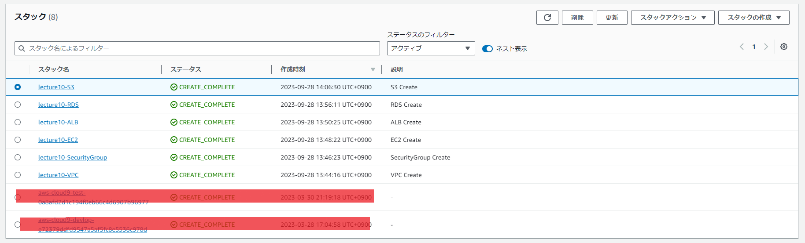    

- EC2→ALBの順で構築する必要があるが、後から構築すべきALBのセキュリティグループIDをEC2構築時点で呼び出す必要があったため 
各リソースのセキュリティグループを1つのテンプレートファイルに分けて作成。  

### コード
cloudformation_templates_1

### 構築した環境
- VPC
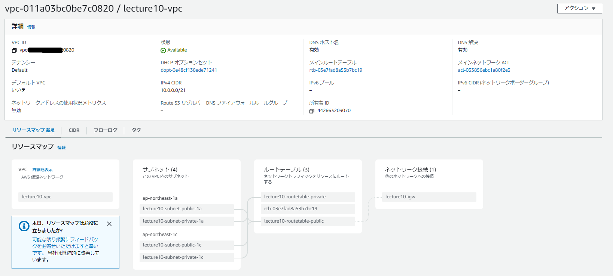  
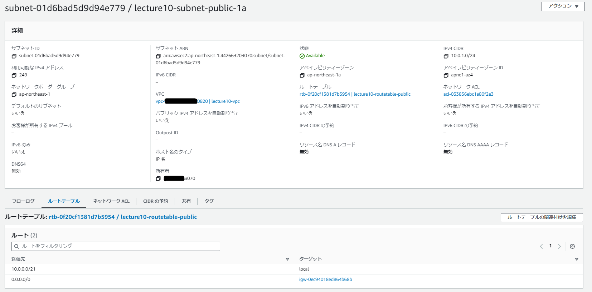  
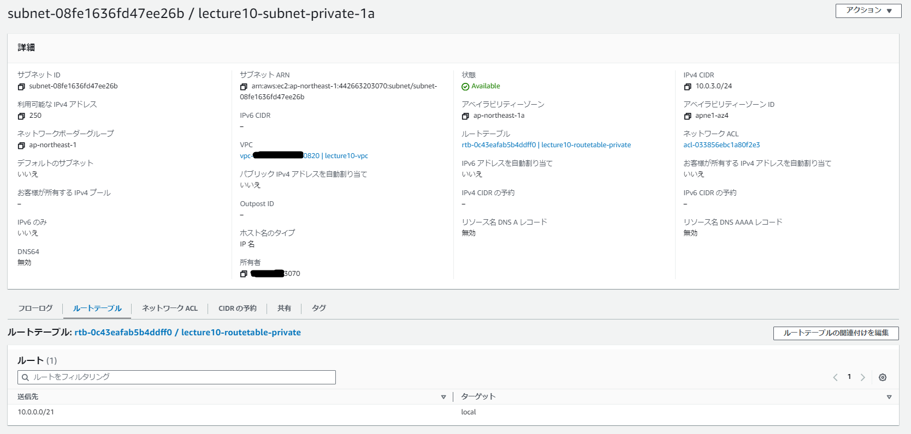  
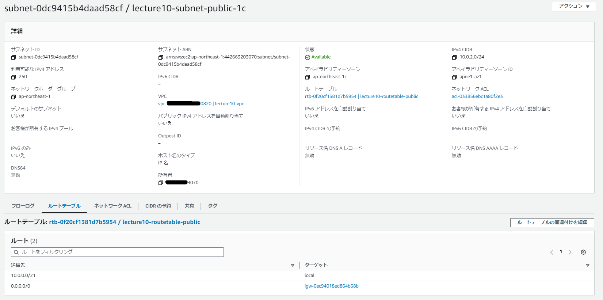  
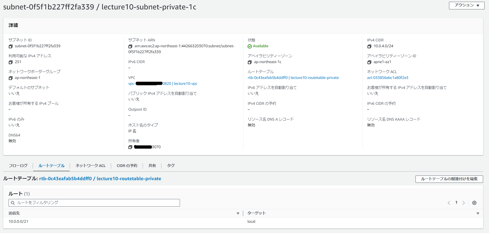  

- セキュリティグループ
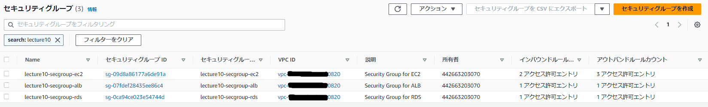  

- EC2
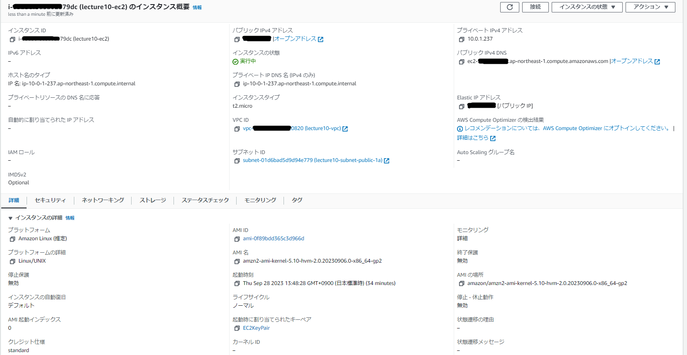 
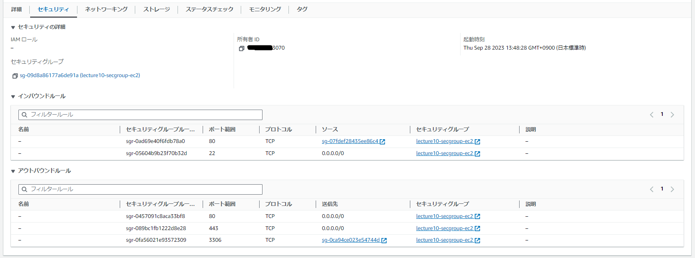  

- ALB
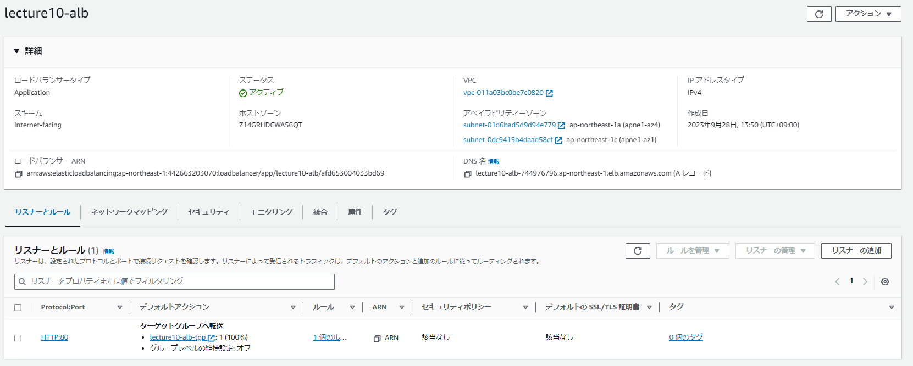  
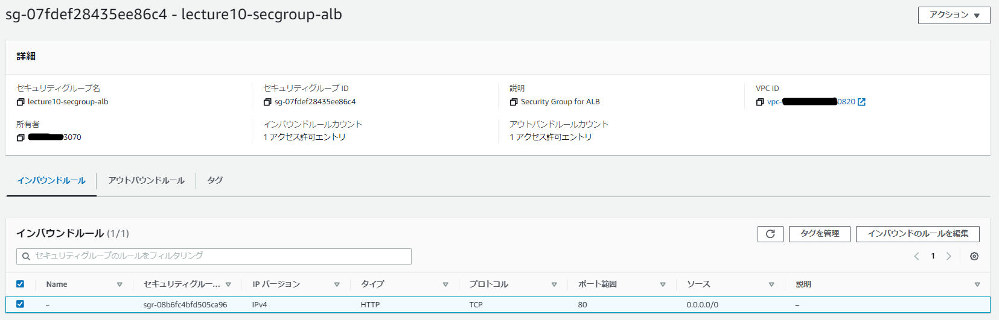  
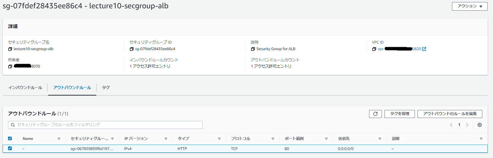  

- RDS
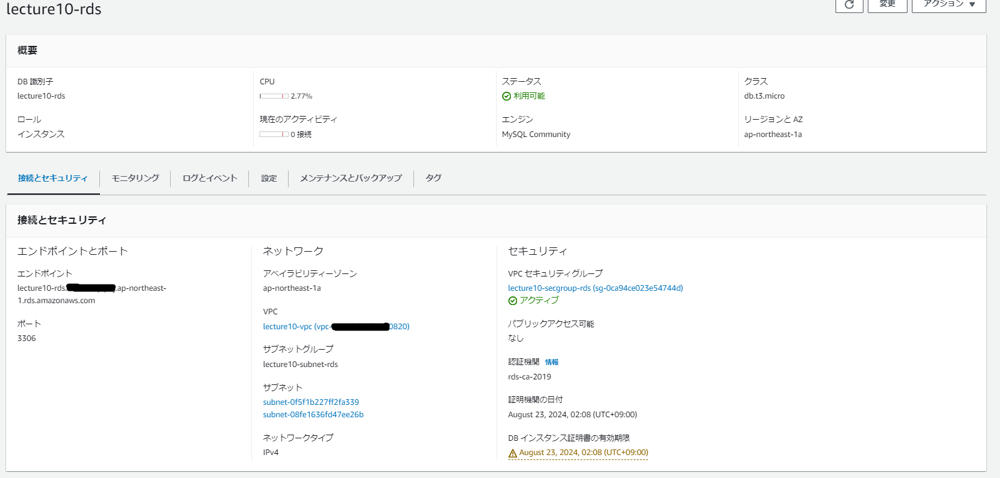 
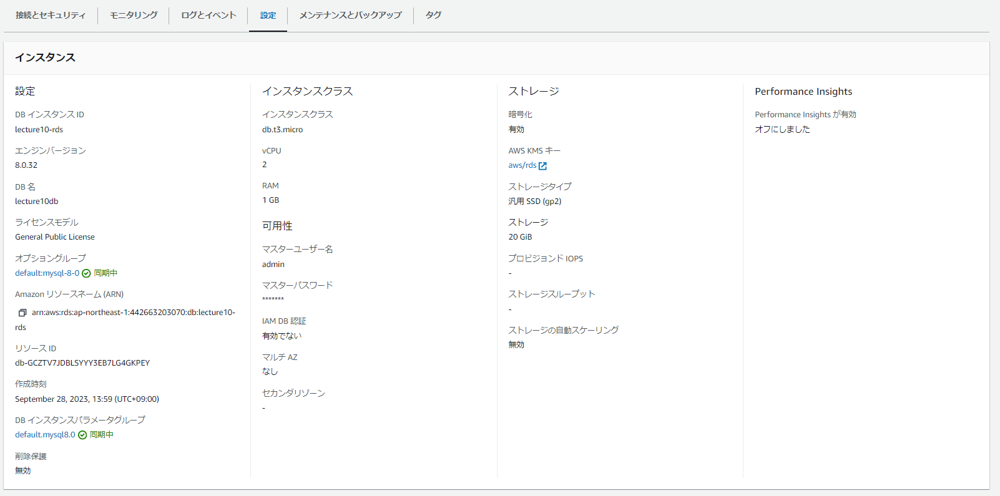 
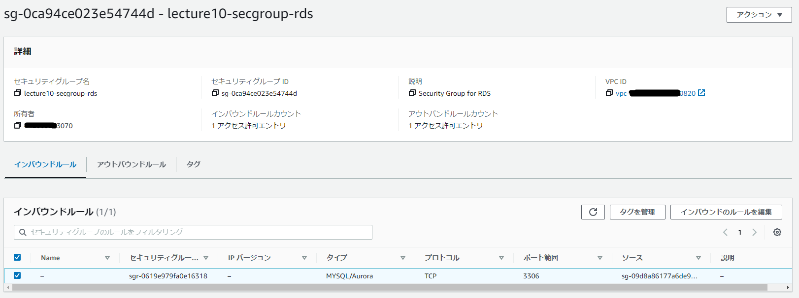  
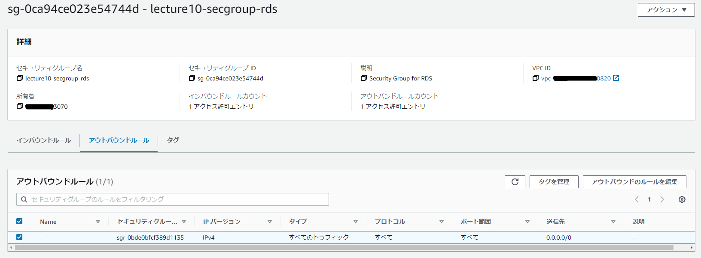 

- S3
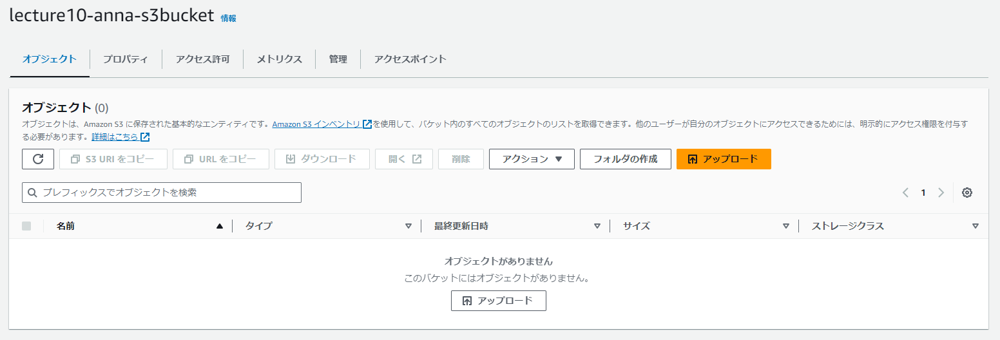 
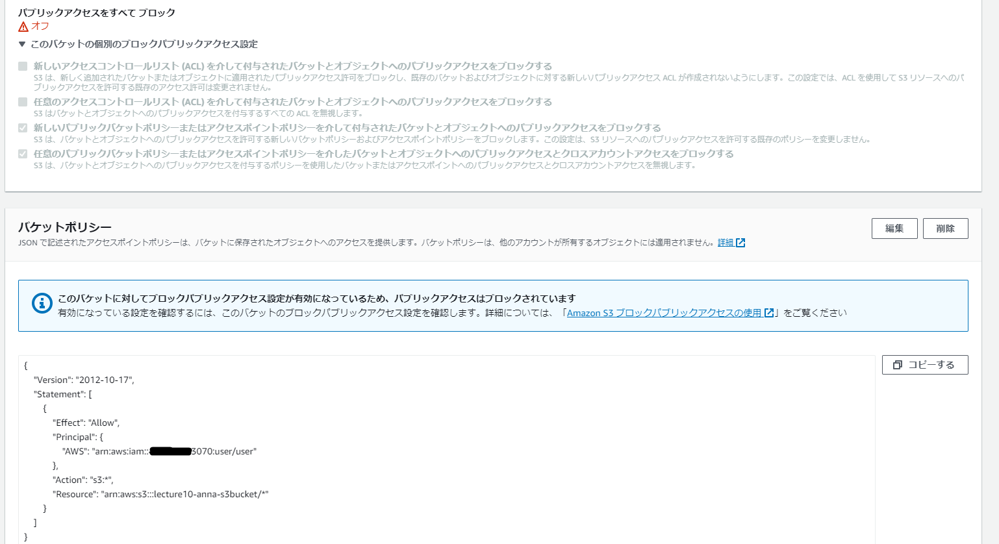 

### メモ
- !Ref [論理ID]：同一テンプレートファイルにあるリソースの論理IDを指定すると、決められたID値などを返す。 
  VPCの論理IDを指定すると、VPC IDを返すなど。 

- !GetAtt [論理ID].[取得したいリソース情報]：同一テンプレートファイルにあるリソースの論理IDを指定すると、決められたリソース情報を返す。 
  セキュリティグループの論理ID.グループIDを指定すると、セキュリティグループIDを返すなど。 

- !ImportValue：異なるテンプレートファイルにあるリソースの論理IDを指定すると、Export元で指定した値を返す。 
  Export元でOutputsの指定が必要。  