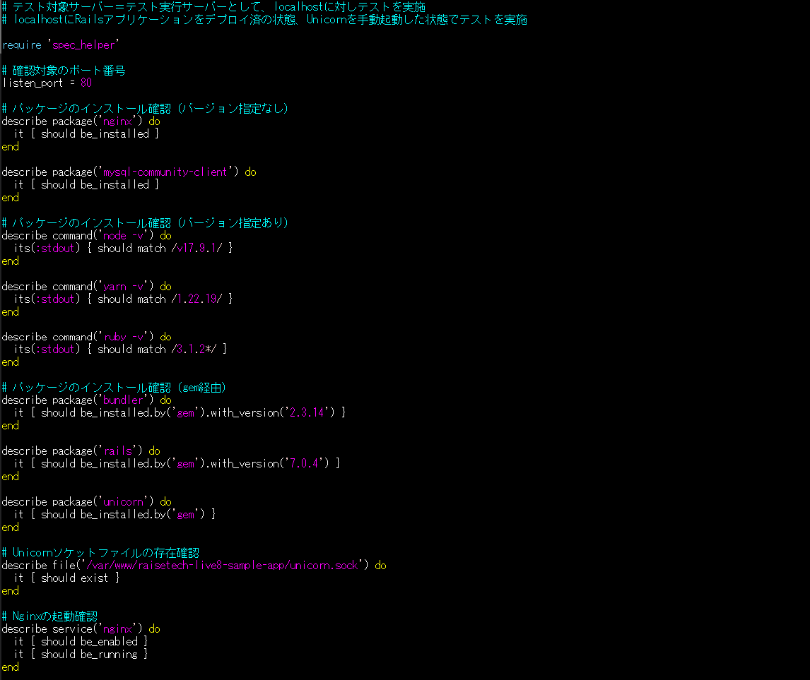
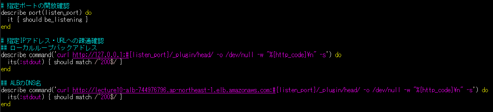
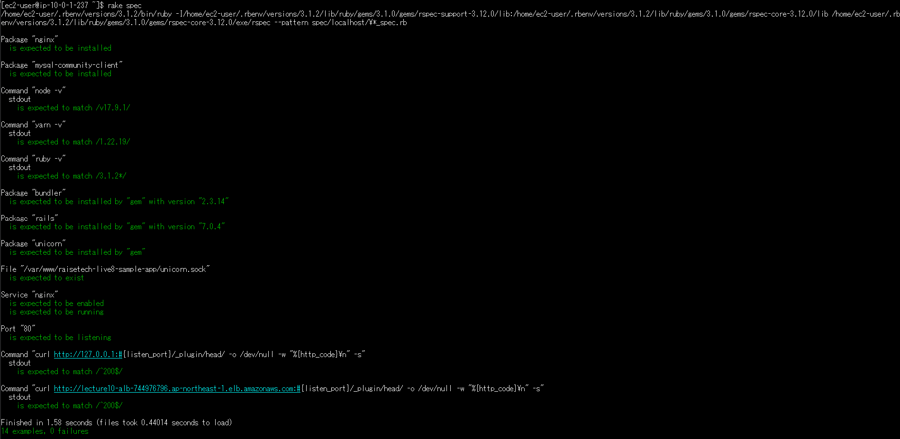

## ServerSpecでのインフラテスト
ServerSpecはインフラのテストに使用するツール。
たとえばテスト対象サーバーに所定のパッケージがインストール済みかどうかなど、複数のテスト項目を一括でテスト可能。  
まずテスト項目を設定し、各項目のテストをクリアできるように開発・構築していくという「テスト駆動開発」の手法もある。  

### 構築内容
前回CloudFormationを用いて構築したAWS環境上でServerSpecのテストを実施し、成功することを確認する。

### 行ったこと
1. Railsアプリをデプロイ
2. EC2上にServerSpecをインストール
3. ServerSpec初期設定 （`serverspec-init`コマンド）
4. サンプルコードでの動作確認 （`rake spec`コマンド）
5. オリジナルコードでのテスト実施 （`rake spec`コマンド）

- 今回はテスト実行とテスト対象のサーバーを分けないためlocalhostのテストとして設定。

#### テスト内容（サンプル）
- Nginxがインストール済みかどうか確認する。
- ポート番号8080番が解放されているか確認する。
- curlコマンドでローカルループバックアドレス宛て＆ポート番号8080番宛てにHTTPリクエストを行い、
標準出力の値が「200」（＝HTTPステータスコード200）と合致するか確認する。

#### テスト内容（オリジナル）
- 必要なパッケージがインストールされているか、バージョン指定があるものは該当バージョンがインストールされているか。
アプリケーションの動作に必要なパッケージがそろっているか確認するため。

- Unicornのソケットファイルが存在するか。
Unicornが使える状態になっているか確認するため。

- Nginxサービスが起動されているか、常時起動の設定になっているか。
Nginxが使える状態になっているか確認するため。

- ポート80番で通信できる設定になっているか。
Nginxで利用する80番ポートで通信ができる設定になっているか確認するため。

- localhostやALBエンドポイントに対して通信できる状態になっているか。
localhost＝テスト対象サーバーが起動していて通信可能な状態かどうか確認するため。

  
 

## 動作確認
- 全項目のテストが成功したことを確認。  
 

### メモ
- curlコマンド：様々なプロトコルでデータ送受信が出来るコマンド。WebサイトへHTTPリクエストを送信してコンテンツを取得する使い方が多い。
  - 「-o」オプション：取得したコンテンツをファイル出力する。
  - 「-w」オプション：送受信が終わった後に出力するテキストを指定する。「-o」とともに使うとHTTPステータスコードのみ抜粋できる。
  - 「-s」オプション：ファイル出力時の進捗状況やエラーを非表示にする。
  
- ローカルループバックアドレス：自分自身を表す特別なIPアドレス。TCP/IPが有効なコンピュータでは常に利用可能。「127.0.0.1～127.255.255.254」の範囲であればどのIPアドレスでも利用できる。

- stdout, stderr：標準出力と標準エラー出力を指す。ディスプレイ上での文字表示が設定されることが多い。今回はファイルに書き出された標準出力の結果を使用。