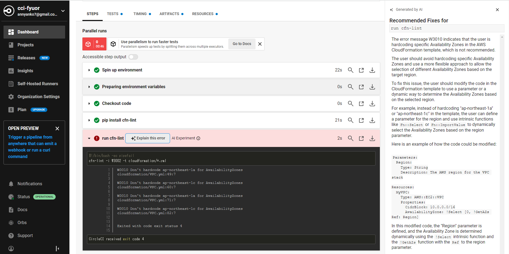
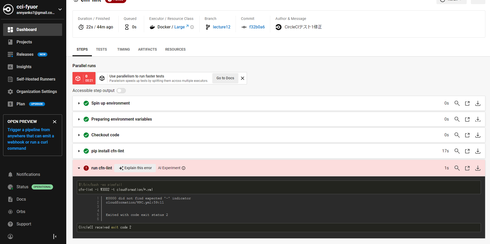
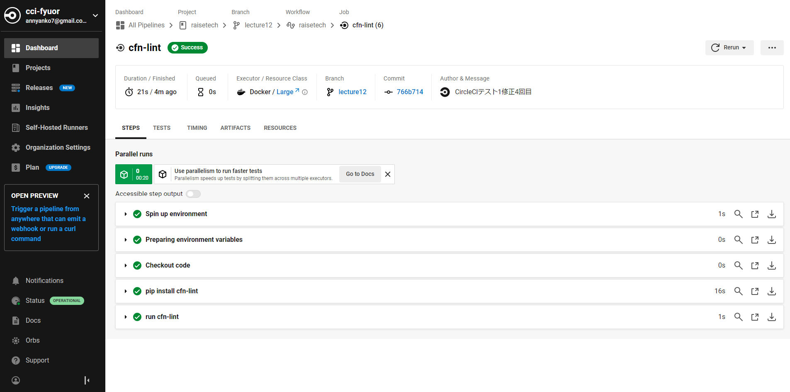

## DevOpsとCircleCIの利用

### やったこと
CircleCIのコンフィグをGitHubリポジトリに組み込み、正しく動作することを確認する。

1. CircleCIのアカウント作成・Githubとの連携設定  
2. 「.circleci」ディレクトリ作成・コンフィグファイル配置  
3. 「cloudformation」ディレクトリ作成・CFnテンプレートファイル配置  
4. ローカルリポジトリからのpushとCircleCIの起動確認
5. CircleCIの起動結果確認

### コンフィグ内容
- cfn-lintがcloudformationディレクトリ内のCFnテンプレートの内容をチェックする。 

### 動作確認
- CFnテンプレート上で、AZの設定をハードコーディングしていたことが原因でエラーとなった。  
  

- CFnテンプレート上で、関数の記法誤りが原因でエラーとなった。形式がNG、「""」や「''」で囲んでいたなど。  
  
  

- 修正のうえ、テスト結果がSuccessになったことを確認。   
 

### メモ
- cfn-lint：AWS CloudFormation Linterというツールのこと。CloudFormationのテンプレートを詳しくチェックし、誤りを指摘する。  

***

#### DevOpsとは

開発と運用のチームを統合し、お互いの業務内容を把握し協力体制を築きながら開発・運用していくこと。  
開発時には運用を考慮した実装や環境構築を、運用時には運用で得られた知見や分析結果をリアルタイムで開発メンバーにも共有するなど。  
- 開発体制：ビルドやデプロイの自動化、ダウンタイムをゼロにする仕組みの構築、自動バックアップや復旧の自動化など  
- 運用体制：情報をリアルタイムで共有する、問題発生時のアラート通知、SNS通知、自動アクション、監視・分析ツールの利用など  

#### CI/CDとは

DevOpsを進めていくうえでCI/CDは重要。Continuous Integration/Continuous Deliveryの略。継続的インテグレーション、継続的デリバリー。   
アプリやインフラ環境のコードに関わる部分のテストを自動化し、常にリリース可能な状態にすることをCIと言う。リリースまで行うところを含めるのがCD。   
テストが通る＝リリースOK状態とするので、効果的なテストコードをしっかり書く必要がある。 

#### CI/CDツールについて

CI/CDツールはジョブ機能（定型作業を自動化した小さい単位＝ジョブとする）、トリガー機能（ジョブの起動条件を指定する）、パイプライン機能（ジョブ実行とトリガー実行を一連の流れとする）を備えていることが多い。  
以前はJenkins一択だったが、最近はCircleCIやGitHub Actionsを使うケースが多く、インフラ環境がAWSならAWS Code Buildを利用できる。  
CI/CDツールは手動で実行せず、イベントトリガーを活用し自動実行する。  