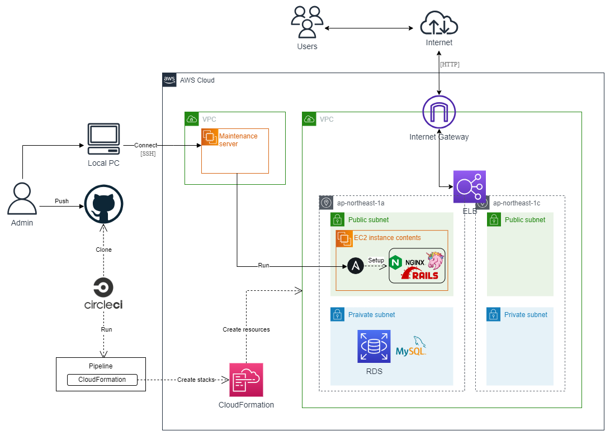

# 構成図

# 何ができるか
## Ansible
メンテナンスサーバーから手動実行すると、パッケージ・ミドルウェアをセットアップする。
※CircleCIからの自動実行へ変更予定

## CircleCI
[コード](.circleci/config.yml)
GitHubへpushするとCircleCIが起動し、以下を自動実行する。  
・CloudFormationのテンプレートチェック  
・CloudFormationのスタック作成

## CloudFormation
[コード](cloudformation/)
以下のAWSリソースを自動作成する。  
・VPC  
・ALB  
・EC2  
・RDS（MySQL）  
・セキュリティグループ  